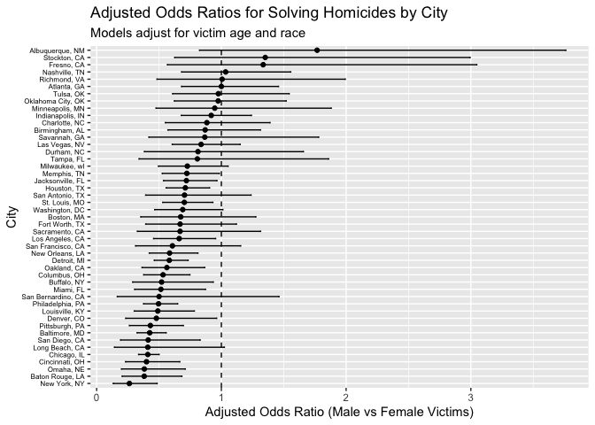
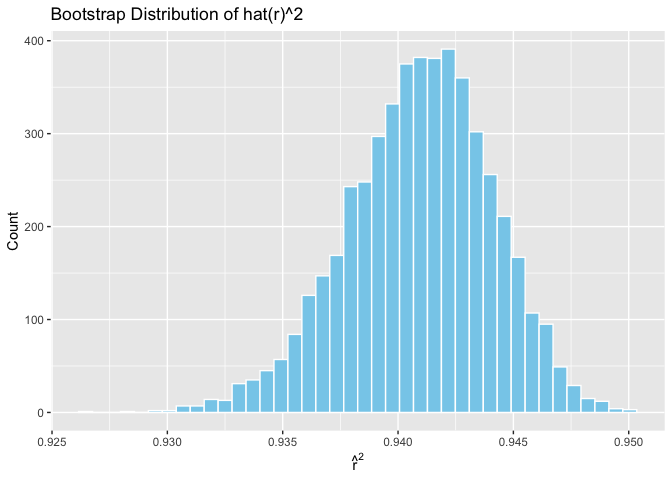
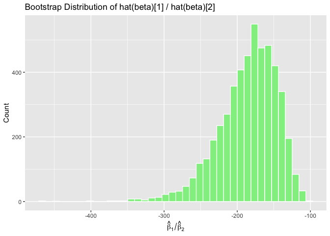
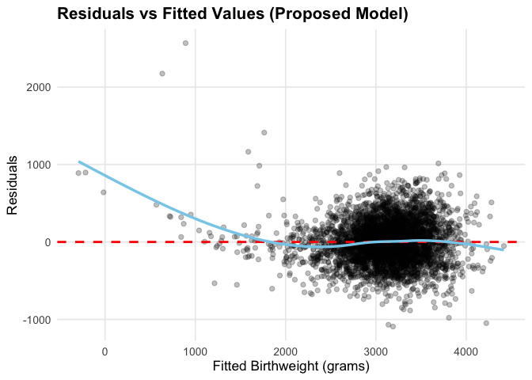

p8105_hw6_xf2302
================
Xiuhong Fan
2025-11-30

# Problem 1

# Load packages and read local CSV

``` r
library(tidyverse)
```

    ## Warning: package 'ggplot2' was built under R version 4.5.2

    ## ── Attaching core tidyverse packages ──────────────────────── tidyverse 2.0.0 ──
    ## ✔ dplyr     1.1.4     ✔ readr     2.1.5
    ## ✔ forcats   1.0.0     ✔ stringr   1.5.1
    ## ✔ ggplot2   4.0.1     ✔ tibble    3.3.0
    ## ✔ lubridate 1.9.4     ✔ tidyr     1.3.1
    ## ✔ purrr     1.1.0     
    ## ── Conflicts ────────────────────────────────────────── tidyverse_conflicts() ──
    ## ✖ dplyr::filter() masks stats::filter()
    ## ✖ dplyr::lag()    masks stats::lag()
    ## ℹ Use the conflicted package (<http://conflicted.r-lib.org/>) to force all conflicts to become errors

``` r
library(broom)
library(purrr)
library(modelr)
```

    ## 
    ## Attaching package: 'modelr'
    ## 
    ## The following object is masked from 'package:broom':
    ## 
    ##     bootstrap

``` r
library(forcats)
library(rsample)
library(p8105.datasets)

homicides =
  read_csv("Data/homicide-data.csv")
```

    ## Rows: 52179 Columns: 12
    ## ── Column specification ────────────────────────────────────────────────────────
    ## Delimiter: ","
    ## chr (9): uid, victim_last, victim_first, victim_race, victim_age, victim_sex...
    ## dbl (3): reported_date, lat, lon
    ## 
    ## ℹ Use `spec()` to retrieve the full column specification for this data.
    ## ℹ Specify the column types or set `show_col_types = FALSE` to quiet this message.

# Data cleaning

``` r
homicides_clean =
  homicides %>%
  mutate(
    city_state = str_c(city, state, sep = ", "),
    solved = if_else(disposition == "Closed by arrest", 1, 0),
    victim_age = as.numeric(victim_age)
  ) %>%
  filter(
    !city_state %in% c("Dallas, TX", "Phoenix, AZ", "Kansas City, MO", "Tulsa, AL"),
    victim_race %in% c("White", "Black")
  )
```

    ## Warning: There was 1 warning in `mutate()`.
    ## ℹ In argument: `victim_age = as.numeric(victim_age)`.
    ## Caused by warning:
    ## ! NAs introduced by coercion

# Baltimore logistic regression

``` r
baltimore_df =
  homicides_clean %>%
  filter(city_state == "Baltimore, MD")

baltimore_fit =
  glm(
    solved ~ victim_age + victim_sex + victim_race,
    data = baltimore_df,
    family = binomial()
  )

baltimore_results =
  tidy(baltimore_fit, conf.int = TRUE, exp = TRUE) %>%
  filter(term == "victim_sexMale") %>%
  select(estimate, conf.low, conf.high)

baltimore_results
```

    ## # A tibble: 1 × 3
    ##   estimate conf.low conf.high
    ##      <dbl>    <dbl>     <dbl>
    ## 1    0.426    0.324     0.558

For Baltimore, MD, the adjusted odds ratio comparing male to female
victims is 0.426, with a 95% confidence interval of 0.324 to 0.558. This
means that, after adjusting for victim age and race, homicides involving
male victims are significantly less likely to be solved than those
involving female victims. Because the confidence interval lies entirely
below 1, the association is statistically meaningful and indicates a
substantially lower clearance rate for male-victim homicides in
Baltimore. \# Fit glm for each city and extract OR

``` r
city_or_results =
  homicides_clean %>%
  nest(data = -city_state) %>%
  mutate(
    fit = map(
      data,
      ~ glm(
          solved ~ victim_age + victim_sex + victim_race,
          data = .x,
          family = binomial()
        )
    ),
    tidy_fit = map(fit, ~ tidy(.x, conf.int = TRUE, exp = TRUE))
  ) %>%
  unnest(tidy_fit) %>%
  filter(term == "victim_sexMale") %>%
  select(city_state, estimate, conf.low, conf.high)
```

    ## Warning: There were 43 warnings in `mutate()`.
    ## The first warning was:
    ## ℹ In argument: `tidy_fit = map(fit, ~tidy(.x, conf.int = TRUE, exp = TRUE))`.
    ## Caused by warning:
    ## ! glm.fit: fitted probabilities numerically 0 or 1 occurred
    ## ℹ Run `dplyr::last_dplyr_warnings()` to see the 42 remaining warnings.

# Forest plot of ORs across cities

``` r
city_or_plot =
  city_or_results %>%
  arrange(estimate) %>%
  mutate(city_state = factor(city_state, levels = city_state)) %>%
  ggplot(aes(x = estimate, y = city_state)) +
  geom_point() +
  geom_errorbarh(aes(xmin = conf.low, xmax = conf.high), height = 0.2) +
  geom_vline(xintercept = 1, linetype = "dashed") +
  labs(
    x = "Adjusted Odds Ratio (Male vs Female Victims)",
    y = "City",
    title = "Adjusted Odds Ratios for Solving Homicides by City",
    subtitle = "Models adjust for victim age and race"
  ) +
  theme(
    axis.text.y = element_text(size = 6, colour = "black")   
  )
```

    ## Warning: `geom_errorbarh()` was deprecated in ggplot2 4.0.0.
    ## ℹ Please use the `orientation` argument of `geom_errorbar()` instead.
    ## This warning is displayed once every 8 hours.
    ## Call `lifecycle::last_lifecycle_warnings()` to see where this warning was
    ## generated.

``` r
city_or_plot
```

    ## `height` was translated to `width`.

<!-- -->

Across the 50 cities, the estimated odds ratios span a broad range,
indicating substantial variability in the association between victim sex
and homicide clearance rates. However, most estimates fall below 1,
suggesting that homicides involving male victims are generally less
likely to be solved than those involving female victims after adjusting
for age and race. A small number of cities have odds ratios near or
above 1, although these estimates typically have wide confidence
intervals, reflecting limited sample sizes or greater statistical
uncertainty. Overall, the plot highlights considerable heterogeneity
across cities, but the prevailing pattern is that male-victim homicides
tend to exhibit lower clearance rates.

# Problem 2

# Functions for Model Fitting and Bootstrap Statistics

``` r
fit_lm <- function(df) {
  lm(tmax ~ tmin + prcp, data = df)
}

boot_fn <- function(df) {
  sample_df = df %>% sample_frac(replace = TRUE)
  fit = fit_lm(sample_df)
  
  r2 = glance(fit)$r.squared
  
  coef_df = tidy(fit)
  beta1 = coef_df$estimate[coef_df$term == "tmin"]
  beta2 = coef_df$estimate[coef_df$term == "prcp"]
  
  ratio = beta1 / beta2
  
  tibble(r2 = r2, ratio = ratio)
}

set.seed(123)

boot_results =
  tibble(rep = 1:5000) %>%
  mutate(
    out = map(rep, ~ boot_fn(weather_df))
  ) %>%
  unnest(out)
```

# Distribution plots

``` r
r2_plot =
  boot_results %>%
  ggplot(aes(x = r2)) +
  geom_histogram(bins = 40, fill = "skyblue", color = "white") +
  labs(
    title = "Bootstrap Distribution of hat(r)^2",
    x = expression(hat(r)^2),
    y = "Count"
  )

ratio_plot =
  boot_results %>%
  ggplot(aes(x = ratio)) +
  geom_histogram(bins = 40, fill = "lightgreen", color = "white") +
  labs(
    title = "Bootstrap Distribution of hat(beta)[1] / hat(beta)[2]",
    x = expression(hat(beta)[1] / hat(beta)[2]),
    y = "Count"
  )

r2_plot
```

<!-- -->

``` r
ratio_plot
```

<!-- -->

# 95% confidence intervals

``` r
r2_ci =
  boot_results %>%
  summarize(
    low = quantile(r2, 0.025),
    high = quantile(r2, 0.975)
  )

ratio_ci =
  boot_results %>%
  summarize(
    low = quantile(ratio, 0.025),
    high = quantile(ratio, 0.975)
  )

r2_ci
```

    ## # A tibble: 1 × 2
    ##     low  high
    ##   <dbl> <dbl>
    ## 1 0.934 0.947

``` r
ratio_ci
```

    ## # A tibble: 1 × 2
    ##     low  high
    ##   <dbl> <dbl>
    ## 1 -279. -125.

## Distribution of $\hat{r}^{2}$

The bootstrap distribution of $\hat{r}^{2}$ is tightly concentrated
around 0.94 with a narrow and nearly symmetric spread, indicating that
the linear regression model explains a consistent proportion of
variability in *tmax* even under repeated resampling.

The 95% bootstrap confidence interval ranges from **0.934 to 0.947**,
showing that the model fit remains stable across bootstrap samples.

## Distribution of $\hat{\beta}_{1}/\hat{\beta}_{2}$

In contrast, the bootstrap distribution of the ratio
$\hat{\beta}_{1}/\hat{\beta}_{2}$ is much wider and strongly left-skewed
because the precipitation coefficient $\hat{\beta}_{2}$ is very small
and varies near zero, making the ratio highly unstable under resampling.

The 95% bootstrap confidence interval is **\[-279.3, -125.3\]**,
reflecting substantial uncertainty and indicating that this ratio is not
a reliable or interpretable summary of the model.

# Problem 3

``` r
birth <- 
  read_csv("Data/birthweight.csv") %>% 
  janitor::clean_names() %>%
  mutate(
    babysex = factor(babysex, labels = c("male", "female")),
    frace   = factor(frace),
    mrace   = factor(mrace),
    malform = factor(malform, labels = c("absent", "present"))
  ) %>%
  drop_na()
```

    ## Rows: 4342 Columns: 20
    ## ── Column specification ────────────────────────────────────────────────────────
    ## Delimiter: ","
    ## dbl (20): babysex, bhead, blength, bwt, delwt, fincome, frace, gaweeks, malf...
    ## 
    ## ℹ Use `spec()` to retrieve the full column specification for this data.
    ## ℹ Specify the column types or set `show_col_types = FALSE` to quiet this message.

``` r
model_1 <- 
  lm(bwt ~ gaweeks + bhead + blength + delwt + ppwt + fincome + smoken, 
     data = birth)

summary(model_1)
```

    ## 
    ## Call:
    ## lm(formula = bwt ~ gaweeks + bhead + blength + delwt + ppwt + 
    ##     fincome + smoken, data = birth)
    ## 
    ## Residuals:
    ##      Min       1Q   Median       3Q      Max 
    ## -1097.14  -186.34    -7.74   176.21  2528.29 
    ## 
    ## Coefficients:
    ##               Estimate Std. Error t value Pr(>|t|)    
    ## (Intercept) -6100.2099    95.9185 -63.598  < 2e-16 ***
    ## gaweeks        13.3174     1.4845   8.971  < 2e-16 ***
    ## bhead         132.6913     3.4764  38.170  < 2e-16 ***
    ## blength        78.1752     2.0561  38.022  < 2e-16 ***
    ## delwt           4.0022     0.4006   9.990  < 2e-16 ***
    ## ppwt           -2.3783     0.4328  -5.495 4.14e-08 ***
    ## fincome         1.2987     0.1656   7.841 5.57e-15 ***
    ## smoken         -2.6686     0.5787  -4.611 4.12e-06 ***
    ## ---
    ## Signif. codes:  0 '***' 0.001 '**' 0.01 '*' 0.05 '.' 0.1 ' ' 1
    ## 
    ## Residual standard error: 279.6 on 4334 degrees of freedom
    ## Multiple R-squared:  0.7025, Adjusted R-squared:  0.702 
    ## F-statistic:  1462 on 7 and 4334 DF,  p-value: < 2.2e-16

``` r
birth %>%
  add_predictions(model_1) %>%
  add_residuals(model_1) %>%
  ggplot(aes(x = pred, y = resid)) +
  geom_point(alpha = 0.3) +
  geom_hline(yintercept = 0, color = "red") +
  labs(
    x = "Fitted values",
    y = "Residuals",
    title = "Residuals vs Fitted for Model 1"
  )
```

<!-- -->

``` r
model_2 <- lm(bwt ~ blength + gaweeks, data = birth)
```

``` r
model_3 <- lm(bwt ~ bhead * blength * babysex, data = birth)
```

``` r
set.seed(123)

cv_df <- crossv_mc(birth, 100)

cv_results <- cv_df %>%
  mutate(
    model_1 = map(train, ~ lm(bwt ~ gaweeks + bhead + blength + delwt + ppwt + 
                                fincome + smoken, data = .x)),
    model_2 = map(train, ~ lm(bwt ~ blength + gaweeks, data = .x)),
    model_3 = map(train, ~ lm(bwt ~ bhead * blength * babysex, data = .x)),
    
    rmse_1 = map2_dbl(model_1, test, ~ rmse(model = .x, data = .y)),
    rmse_2 = map2_dbl(model_2, test, ~ rmse(model = .x, data = .y)),
    rmse_3 = map2_dbl(model_3, test, ~ rmse(model = .x, data = .y))
  ) %>%
  select(starts_with("rmse"))
```

``` r
cv_results %>% 
  summarize(
    model_1 = mean(rmse_1),
    model_2 = mean(rmse_2),
    model_3 = mean(rmse_3)
  )
```

    ## # A tibble: 1 × 3
    ##   model_1 model_2 model_3
    ##     <dbl>   <dbl>   <dbl>
    ## 1    280.    331.    288.
